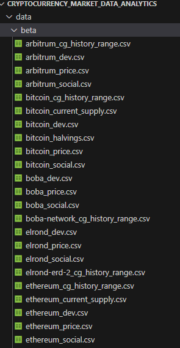
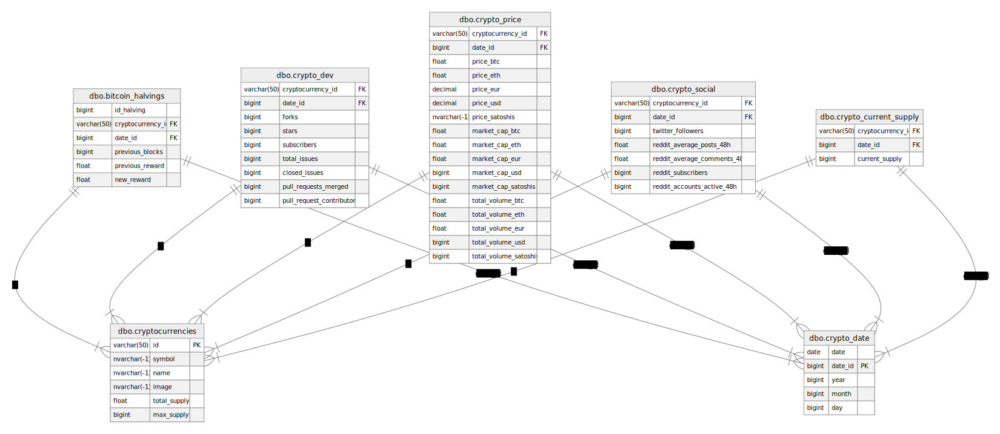
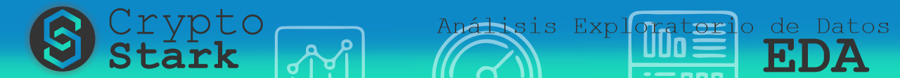
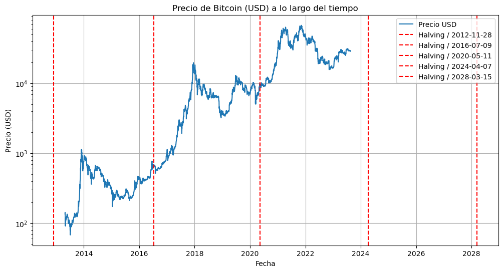
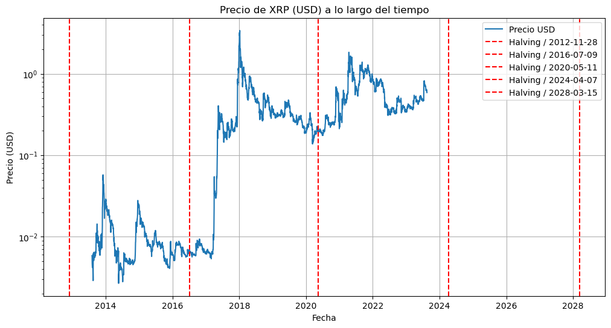
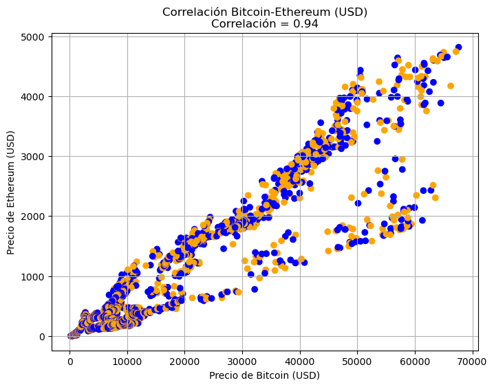
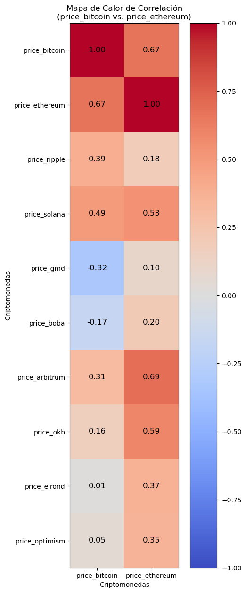
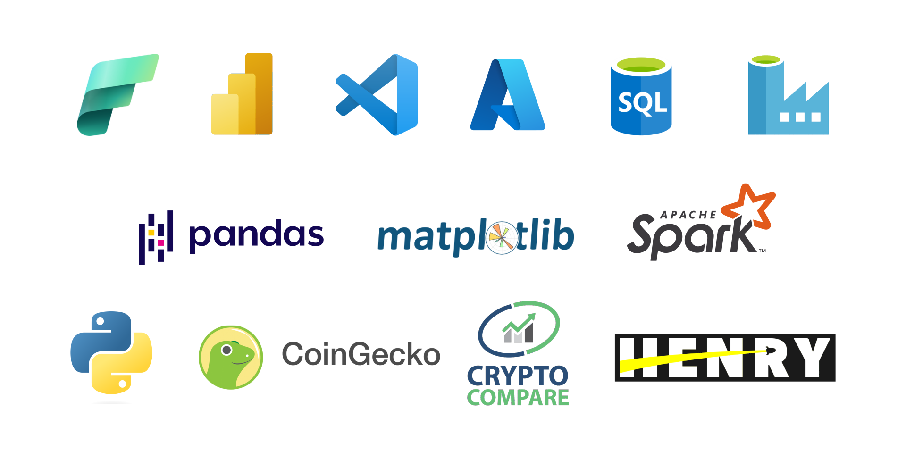

## Crypto Stark 


# Análisis del mercado de criptomonedas

Este repositorio contiene un análisis exhaustivo de 10 criptomonedas cuidadosamente seleccionadas para evaluar su potencial de inversión. A continuación, proporcionamos una descripción más detallada de cada criptomoneda, así como la razón por la que fue seleccionada para su análisis. 🚀

## 1. Bitcoin (BTC) 
- **Descripción**: Bitcoin es la criptomoneda más grande del mundo por capitalización de mercado. Se trata de una moneda digital descentralizada que no está controlada por ningún gobierno o banco central. Bitcoin se utiliza ampliamente para realizar pagos, transferir fondos y como una reserva de valor digital.
- **Razón de Elección**: Bitcoin se incluye en este análisis debido a su posición dominante y su papel fundamental en el ecosistema de las criptomonedas.

## 2. Ethereum (ETH) 
- **Descripción**: Ethereum es la segunda criptomoneda más grande del mundo por capitalización de mercado. Es una plataforma de contratos inteligentes que permite a los desarrolladores crear aplicaciones descentralizadas (dApps). Ethereum se utiliza para crear una amplia gama de aplicaciones, incluyendo finanzas descentralizadas, juegos y aplicaciones sociales.
- **Razón de Elección**: Ethereum se seleccionó debido a su importancia en el desarrollo de aplicaciones descentralizadas y su creciente ecosistema.

## 3. XRP (XRP) 
- **Descripción**: XRP es una criptomoneda utilizada para transferir dinero de manera rápida y económica. XRP es la criptomoneda nativa de la plataforma Ripple, que proporciona servicios para instituciones financieras con el objetivo de facilitar transferencias rápidas y económicas.
- **Razón de Elección**: XRP se incluye en este análisis debido a su potencial para recuperarse en el próximo ciclo alcista y su adopción en el sector financiero.

## 4. Solana (SOL) 
- **Descripción**: Solana es una plataforma blockchain conocida por su velocidad y bajas tarifas de transacción. Utiliza el algoritmo de consenso Proof of History, lo que permite realizar miles de transacciones por segundo.
- **Razón de Elección**: Solana se eligió por su tecnología innovadora y su capacidad para competir en términos de velocidad y eficiencia.

## 5. OKB (OKB) 
- **Descripción**: OKB es una criptomoneda que se utiliza en la plataforma de intercambio de criptomonedas OKEx. Puede utilizarse para pagar tarifas de transacción en OKEx y obtener descuentos en las tarifas de negociación.
- **Razón de Elección**: OKB se incluye en este análisis debido a su relación con un exchange en crecimiento y sus métricas sólidas.

## 6. Arbitrum (ARB) 
- **Descripción**: Arbitrum es una solución de capa 2 para la plataforma Ethereum que permite transacciones rápidas y económicas. Utiliza la tecnología de rollups para ejecutar transacciones fuera de la cadena principal de Ethereum.
- **Razón de Elección**: Arbitrum se eligió por su papel en la escalabilidad de Ethereum y su eficiencia.

## 7. Optimism (OP) 
- **Descripción**: Optimism es otra solución de capa 2 para Ethereum que permite transacciones rápidas y económicas. Al igual que Arbitrum, utiliza la tecnología de rollups para mejorar la escalabilidad de Ethereum.
- **Razón de Elección**: Optimism se incluye para evaluar su rendimiento en comparación con Arbitrum.

## 8. Elrond (EGLD) 
- **Descripción**: Elrond es una plataforma blockchain que permite realizar transacciones de forma rápida y económica. Utiliza el algoritmo de consenso Adaptive State Sharding, lo que permite realizar miles de transacciones por segundo.
- **Razón de Elección**: Elrond se seleccionó por su enfoque en la escalabilidad y su historial de crecimiento incluso durante los ciclos bajistas.

## 9. Boba Network (BOBA) 
- **Descripción**: Boba Network es una solución de capa 2 para Ethereum que facilita transacciones rápidas y económicas. Al igual que Arbitrum y Optimism, utiliza la tecnología de rollups.
- **Razón de Elección**: Boba Network se incluye en el análisis debido a su rápido crecimiento y su importancia en la escalabilidad de Ethereum.

## 10. GMD (GMD) 
- **Descripción**: GMD es un token de Yield Farming optimizado con una plataforma de agregación de otras aplicaciones. Se utiliza para proporcionar liquidez a la plataforma GMD y recompensar a los usuarios por proporcionar liquidez.
- **Razón de Elección**: GMD se eligió por su enfoque en yield farming y su atractivo potencial de rendimiento, también por su suministro total es muy bajo y eso lo hace muy atractivo para los inversores.

>#### Este repositorio proporciona un análisis en profundidad de cada una de estas criptomonedas, lo que ayudará en la toma de decisiones informadas sobre inversiones en el mercado de criptomonedas. Esperamos que esta información sea valiosa para su estrategia de inversión. 📈📊

<br>
<p align="right">

</p>
<br>

# **Mapa del proyecto**

| Carpeta                   | Función                   | Recurso           | Video
|:--------------------------|:----------------------------------------------:|:-------------:|:-------------
| data                      | Carpeta Raiz  de los datasets en general                              |
| data/beta                 | Contiene los dataset con una primera ronda de limpieza                |
| data/launch               | Contiene los dataset con tablas normalizadas a producción             |
| data/original             | Contiene la extracción de las APIs                    |
| media                     | Carpeta de Archivos de diseño y visualización de data                  |
| media/Dashboard.pbix      | Dashboard realizado en Power Bi                   |
| media/diseño de imagen - CM - CryptoStark.cdr | Diseño de imagen del proyecto                   |
| media/Dashboard.pbix      | Dashboard realizado en Power Bi                   |
| source                    | Carpeta de recursos web                   |
| source/img                | Carpeta de imágenes utilizadas en los archivos .md, .ipynb, web        |
| source/notas.txt          | Notas importantes para el roadmap del proyecto                   |
| sql                       | Carpeta de scripts de SQL                   |
| sql/script_column_type_not_null.sql | Script que prepara columnas para PK y FK              |
| sql/script_decimal_type.sql | Script para manejar varios decimales              |
| sql/script_primary_foreign_key.sql | Script para crear claves foraneas y primarias              |
| .gitignore                | Archivos que ignoramos cargar en github                   |
| Análisis_exploratorio_de_datos_(EDA).ipynb | EDA realizado en PySpark a través de Microsoft Fabric | [](https://colab.research.google.com/drive/1pX64SoHDioP9rqaU5PdZTqqKGg6WvIQD?usp=sharing) | [Video](#eda-tips) |
| ETL_cm_coingecko_beta.ipynb | ETL Api de Coingecko |
| ETL_cm_cryptocompare_beta.ipynb | ETL Api de Crypto Compare |
| table_normalization.ipynb | Normalización de tablas para SQL | | [Video](#normalización-de-tablas-)|
<br>

>#### El proceso de EDA está capturado en Colab, puedes ver como funciona PySpark, pandas y matplotlib juntos, sin olvidar que es necesario Java y Hadoop para que funcione sobre el almacenamiento y procesamiento de datos distribuido, puedes ver nuestro análisis y a su vez puedes ver como se hace el montaje de Spark sobre google colab.
<br>


Nuestro objetivo es tener una solución de ingeniería de datos diseñada para la obtención, limpieza y almacenamiento de datos relacionados con criptomonedas para realizar análisis de inversión a mediano y largo plazo. A continuación, se detallan los principales pasos y consideraciones de este proceso.
<br>

## Obtención de Datos 🌐

### - Fuente de Datos 📡
Inicialmente, nos planteamos cómo necesitamos los datos para realizar un análisis de inversión más profundo. Decidimos no utilizar datos de OHLC (Open, High, Low, Close) utilizados comúnmente en el trading, ya que nuestro enfoque es diferente. Utilizamos la API de CoinGecko para obtener datos más amplios.

### - Desafíos Iniciales ❗
Al utilizar la API de CoinGecko, encontramos que el endpoint `/coins/markets` proporciona una sola fila de datos en tiempo real. Cuando recurrimos a un rango histórico con el endpoint `/coins/{id}/market_chart/range`, solo obtenemos tres columnas esenciales: precio, volumen y capitalización de mercado, que no es suficiente para un análisis en profundidad.

### - Solución 🛠️
Para obtener la información necesaria, utilizamos el endpoint `/coins/{id}/history`, que nos permite consultar cada criptomoneda con información detallada limitada a una fecha por extracción. Sin embargo, debido a limitaciones en la API, debemos utilizar un bucle para extraer las fechas necesarias. Comenzamos desde la fecha más antigua disponible para Bitcoin en 2012 y utilizamos un algoritmo diseñado para recopilar estos datos en todas las 10 criptomonedas.

### - Tiempo de Extracción ⏳
El proceso de extracción de datos para las 10 criptomonedas tomó un total de 37 horas debido a las restricciones de la API de CoinGecko. Mientras se extraían los datos, los guardamos como conjuntos de datos CSV en la carpeta `data/original/` del proyecto.
<br>

## Limpieza de Datos 🧹

Realizamos una exhaustiva limpieza de los datos para prepararlos para su normalización. Los archivos en esta fase se encuentran en estado beta, listos para ser normalizados. Se crearon conjuntos de datos para precios, información social, desarrolladores e historial de rango para cada criptomoneda.
<br>


<br>

## Investigación de Fuentes 📚

Para complementar nuestros datos, llevamos a cabo una investigación exhaustiva sobre las fuentes de información disponibles en el mercado de criptomonedas. Después de un análisis minucioso, encontramos que CryptoCompare es la fuente que proporciona la información más completa de forma gratuita. Sin embargo, solo pudimos recopilar información detallada para Bitcoin y Ethereum, ya que necesitábamos datos sobre la oferta circulante en cada fecha para nuestro análisis.
<br>

## Normalización de Tablas 📑

Luego, normalizamos las tablas preparándolas para su posterior carga en una base de datos en Azure SQL. Finalmente, generamos ocho archivos CSV listos para ser migrados. Estos archivos representan los datos normalizados para precios, información social, desarrolladores e historial de rango, fecha, bitcoin halvings, suministro circulante, criptomonedas.
<br>

https://github.com/cistelsa/Cryptocurrency_Market_Data_Analytics/assets/17438992/b5f79c74-fccb-44aa-8e54-7cbd850c8080

> Antes de cualquier acción a normalizar tablas siempre hacemos primero un esquema de como podemos hacerlo de la forma más satisfactoria y óptima. <br> - *Musica de fondo creada por inteligencia artificial - [https://soundful.com/](https://soundful.com/)*

<br>
<p align="right">

</p>

## Carga en Azure SQL (SQL Server)

El proceso de carga se realizó en Microsoft Fabric utilizando Azure SQL Server y Data Factory. Creamos los cuadernos de extracción en Microsoft Azure Databricks y los almacenamos en nuestro Data Lake. Con Data Factory, configuramos Dataflow para transferir los archivos CSV al servidor de Azure SQL utilizando Power Query.
<br>

https://github.com/cistelsa/Cryptocurrency_Market_Data_Analytics/assets/17438992/bd5fa622-97b2-4a90-9cb4-51bbbe10834c


> ☝️ Podemos ver de forma rápida como Dataflow usa Power Query para leer los archivos csv y luego después de asignar el tipo de columna a cada uno, procedemos a enviarlos a Azure SQL por medio de autenticación en este caso básica server, puerto, usuario, contraseña. <br> - *Musica de fondo creada por inteligencia artificial - [https://soundful.com/](https://soundful.com/)*

También automatizamos aún más el proceso mediante la creación de un Data Pipeline que ejecuta automáticamente los trabajos necesarios, incluyendo la ejecución de scripts SQL para establecer relaciones, claves primarias y foráneas.
<br>

https://github.com/cistelsa/Cryptocurrency_Market_Data_Analytics/assets/17438992/bc239611-2851-442c-8cb7-3e555c2b8e3a


> ☝️ Muy similar a Airflow o cron jobs, Data Pipeline automatiza los procesos que están en los notebooks, Dataflow o datos externos, también aprovechamos su funcionalidad y cargamos unos scripts SQL de forma remota conectandonos a Azure SQL. <br> - *Musica de fondo creada por inteligencia artificial - [https://soundful.com/](https://soundful.com/)*


<br>
<p align="right">

</p>
<br>

## Diagrama de Relaciones de Tablas 🗂️



## Diccionario de Datos
<br>

        👇                                                    👇

|**dbo.crypto_price**|              | **dbo.crypto_dev** |          |
|:-----------------------|:-----------------|:------------------------|:------------------------|
| **Columna**        | **Descripción**                      | **Columna**        | **Descripción** |
| cryptocurrency_id |  Id de la Criptomoneda    | cryptocurrency_id  | Id de la Criptomoneda |
| date_id           |  ID de la fecha                       | date_id            | ID de la fecha |
| price_btc         |  Precio de la criptomoneda en bitcoin | forks         | No. de Forks Github |
| price_eth         |  Precio de la criptomoneda en ethereum | stars             | Calificación |
| price_eur         |  Precio de la criptomoneda en euro    | subscribers  | Suscriptores al Github |
| price_usd         |  Precio de la criptomoneda en dolar   | total_issues  | Total de tareas a realizar |
| price_satoshis    |  Precio de la criptomoneda en satoshis | closed_issues     | Tareas Realizadas |
| market_cap_btc    |  Capitalización de Mercado en bitcoin | pull_requests_merged | Actualizaciones del proyecto |
| market_cap_eth    |  Precio de la criptomoneda en ethereum | pull_request_contributors | Contribuciones al proyecto
| market_cap_eur    |  Precio de la criptomoneda en euro    |
| market_cap_usd    |  Precio de la criptomoneda en dolar   |
| market_cap_satoshis | Precio de la criptomoneda en satoshis |
| total_volume_btc  |  Volumen 24 horas en bitcoin          |
| total_volume_eth  |  Volumen 24 horas en ethereum         |
| total_volume_eur  |  Volumen 24 horas en euro             |
| total_volume_usd  |  Volumen 24 horas en dolar            |
| total_volume_satoshis |  Volumen 24 horas en satoshis     |
<br>

---

<br>

|**dbo.cryptocurrencies**|          | **dbo.crypto_date**| **Tabla de Hechos**         |
|:-----------------------|:----------------|:-----------------------|:----------------|
| **Columna**       | **Descripción** | **Columna**       | **Descripción** |
| id                |  Id de la Criptomoneda | date | Fechas de la DB |
| symbol            |  Simbolo de la criptomoneda ej: btc | date_id | Id de Fechas |
| name              |  Nombre oficial de la criptomoneda | year | Año derivado de date |
| image             |  Enlace del icono de la criptomoneda | month | Mes derivado de date |
| total_supply      |  Suministro total de la criptomoneda | day | Día derivado de date |
| max_supply        |  Suministro máximo de la criptomoneda | 
<br>

---

<br>

|**dbo.crypto_social**|          | **dbo.crypto_current_supply**|         |
|:-----------------------|:----------------|:-----------------------|:----------------|
| **Columna**       | **Descripción** | **Columna**       | **Descripción** |
| cryptocurrency_id           |  Id de la Criptomoneda | cryptocurrency_id | Id de la Criptomoneda |
| date_id            |  Id de Fechas | date_id | Id de Fechas | 
| twitter_followers              |  Seguidores de Twitter | current_supply | Suministro circulante de criptomonedas |
| reddit_average_posts_48h    |  Post publicados en reddit ult. 48 h | 
| reddit_average_comments_48h |  Comentarios publicados en reddit ult. 48 h | 
| reddit_subscribers         |  Suscriptores en reddit | 
| reddit_accounts_active_48h |  Cuentas activas en reddit las ult. 48 h | 
<br>



# Analisis Exploratorio de Datos 📈💰

>Te invitamos a ver el [Análisis_exploratorio_de_datos_(EDA).ipynb](Análisis_exploratorio_de_datos_(EDA).ipynb) para visualizar el informe más completo.
<br>

## Introducción 🚀

Este informe presenta un análisis detallado de 10 criptomonedas seleccionadas para un proyecto de inversión a mediano y largo plazo. A continuación, se resumen los hallazgos clave de nuestro análisis exploratorio de datos (EDA), realizado en dos entornos: Microsoft Fabric y Google Colab, utilizando PySpark, Python y Matplotlib.

### Criptomonedas Seleccionadas

1. Bitcoin (btc)
2. Ethereum (eth)
3. Ripple (xrp)
4. Solana (sol)
5. OKB (okb)
6. Arbitrum (arm)
7. Optimism (op)
8. MultiversX (egld)
9. Boba Network (boba)
10. GMD Protocol (gmd)
<br>

## Extracción de Datos 🌐

Inicialmente, intentamos extraer el suministro circulante de las criptomonedas en forma de histórico. Sin embargo, las APIs disponibles solo proporcionaban esta información en tiempo real, lo que limitaba nuestro análisis. Nuestro proyecto continúa en desarrollo, y las tareas pendientes incluyen:

>- Automatizar la extracción en tiempo real, incluyendo el suministro circulante. 
>- Investigar y obtener datos históricos de suministro circulante.
<br>

## Análisis de Capitalización de Mercado 💰

La capitalización de mercado máxima de cada criptomoneda es esencial para nuestras decisiones de inversión. Observamos que el mercado alcista puede llevar las capitalizaciones de mercado mucho más allá de sus máximos históricos. Esto depende de la calidad del proyecto, la comunidad y factores globales.

|          id| MaximoMarket|
|------------|-------------|
|      solana|  77,427,308,372|
|gmd-protocol|      8,696,350|
|      ripple| 131,653,046,805|
|boba-network|    626,008,032|
|     bitcoin|1,278,797,895,528|
|    arbitrum|   2,157,934,242|
|         okb|  14,340,743,027|
|elrond-erd-2|   9,812,675,698|
|    optimism|   1,285,982,741|
|    ethereum| 571,665,766,496|

> Debemos comprender que esta fué la capitalización de mercado `Market_Cap` en dolares (Total en dolares invertidos en la criptomoneda) máxima, demostraremos con gráficas que esta capitalización tiende a ser superada y multiplicada en el ciclo alcista después del halving de bitcoin.
<br>

## Análisis de Caída de Precios 📉

Analizamos la caída de los precios durante el ciclo bajista, comparamos el `Market_Cap` máximo con el útimo resultado de `Market_Cap`, sacamos el porcentaje de caida `PorcentajeCambio`. 


|          id| MaxMarketCap|LastMarketCap|  PorcentajeCambio|
|------------|-------------|-------------|------------------|
|boba-network|    626008032|     44296575| 92.92396059863974|
|elrond-erd-2|   9812675698|    740966252| 92.44888677864874|
|      solana|  77427308372|   9300306072| 87.98833865266681|
|         okb|  14340743027|   2730544222| 80.95953454532255|
|      ripple| 131653046805|  31112167895|  76.3680608614533|
|    ethereum| 571665766496| 217444475880| 61.96300554906124|
|gmd-protocol|      8696350|      3416498| 60.71342574758376|
|     bitcoin|1278797895528| 559982624303| 56.21023257378837|
|    arbitrum|   2157934242|   1335248416|38.123767165283255|
|    optimism|   1285982741|   1007166425|21.681186466249784|


>Claramente podemos analizar que las Altcoins (Criptomoneda diferente a Bitcoin) presentan % de caidas mayores, depende de varios factores, tanto técnicos como fundamentales, es verdad que cuando cae supera por mucho el % del bitcoin, pero en la subida los beneficios son mucho mayores. 

Las cuatro criptomonedas que experimentaron las mayores caídas fueron:

### Boba Network (Boba) 

1. Boba Network todavía está en desarrollo, y no ha logrado alcanzar un nivel de adopción significativo. Esto ha llevado a algunos inversores a perder la confianza en el proyecto.

2. Boba Network realizó un airdrop de tokens BOBA a los titulares de tokens OMG. Esto provocó una venta masiva de tokens OMG, ya que algunos inversores vendieron sus tokens OMG para obtener tokens BOBA, si boba no le pone utilidad a los token ganar rentabilidad, hace que se generen ventas masivas después del airdrop y que el token BOBA baje.

>**Conclusión:** *Es una Criptomoneda de alto riesgo pero vale la pena correrlo ya que fué uno de los pioneros en implementar una blockchain de capa 2 para darle solución a las comisiones y velocidad en paralelo a la red de ethereum, las cuales serán una tendencia real en el próximo mercado alcista, la recuperación que tuvo en este 2023 fué muy favorable.*

### MultiversX (EGLD) 

1. Es un Proyecto que cambió de nombre recientemente y se transformó en una plataforma de soluciones web 3 y el metaverso de crypto juegos el cual ha empezado a tener fuerza.

2. Afectaciones en su plataforma han surgido y tiene muy grandes competidores, como descentraland, The Sandbox, Axie Infinity las cuales han sufrido grandes caidas.

>**Conclusión:** *Es un proyecto muy favorable para el ecosistema de criptomonedas el cual va a seguir en tendencia en la siguiente temporada alcista dandole solución a plataformas de web 3 y el metaverso.*

### Solana (SOL) 

1. Solana se vió muy afectada por la quiebra de la empresa de FTX la cual erá el segundo exchage más grande después de binance, esto llevó a una venta masiva y posterior caida de market cap.

2. Una competencia muy amplia con blockchains de alto nivel como Cardano, Avalache, Ethereum y sus derivados .

>**Conclusión:** *Aunque es muy criticada por su gobernanza centralizada, en verdad es muy veloz y de comisiones bajas, está de seguro va estar dentro de las tendencias el próximo mercado alcista.*

### OKB (OKB) 

>OKB es una criptomoneda que realmente creció en este mercado bajista, los datos obtenidos de Coingecko se encuentran errados, se corroboraron los datos en su totalidad y OKB genera inconsistencias.

### XRP (XRP) 

1. XRP a pesar de que tiene una demanda en curso por parte de la SEC (Agencia Gubernamental y Federal encargada de regular los mercados financieros) no cayó como muchos esperaban, no superó su maximo histórico de 2017, pero no se fué a 0.

2. Es una solución para bancos muy reconocidos, sus comisiones son baratas y es una red rápida .

>**Conclusión:** No se sabe a ciencia sierta cual será el rumbo de esta criptomoneda, este analisis es más fundamental que técnico, pero aun así los datos nos demuestran que en mercado bajista recuperó muchas posiciones.
<br>

## Halving de Bitcoin - Análisis de BTC ⛓️

El evento de halving de Bitcoin es un indicador importante para el próximo ciclo alcista. Se espera que el próximo halving ocurra en abril de 2024.



>☝️ Analizando el gráfico anterior podemos darnos cuenta que cada vez que ocurre el evento de halving de bitcoin, es una puerta muy grande para que el ciclo alcista comience, en este proyecto de inversión lo vamos a tener muy en cuenta, se aproxima uno de los eventos de halving para el proximo año y para esta fecha ya debemos tener la mayoría de la inversión acentada.
<br>

## Halving de Bitcoin - Análisis de XRP 🌐

XRP experimentó una subida muy pequeña a comparación de lo que se esperaba, conocemos sus problemas legales aun así respondió positivamente.



>☝️ Ahora analicemos la criptomoneda XRP, podemos darnos cuenta que sucede exactamente lo mismo que bitcoin, pero a diferencia que en el ultimo halving ya ocurrido no pudo superar su máximo histórico, el resultado de la demanda ya estuvo a favor de la cryptomoneda, por lo cual incrementó su valor en pleno ciclo bajista, esperamos mucho de XRP para el próximo ciclo alcista, no alcanzará a Ethereum por su sólido proyecto pero al ser usada en movimientos financieros bancarios muy importantes le espera un gran futuro.
<br>

## Correlación de Precios de Bitcoin y Ethereum 📊

Ethereum representa las Altcoins y sigue de cerca a Bitcoin. Los patrones muestran que Ethereum sigue a Bitcoin, pero a menudo supera sus ganancias después de caídas impulsadas por noticias.
En el siguiente gráfico nivelamos los datos de correlación a agosto de 2015 hasta agosto de 2023 nos representa una correlación del **94%**.

<p align=center>

</p>

>☝️ Algo muy esperado la correlación de Bitcoin y Ethereum, nos deja varias conclusiones una de ellas es que podemos ver como se repite un patron y es cuando bitcoin sube de precio de forma natural ethereum lo sigue casi de forma inmediata, pero si bitcoin sube por fomo o por noticias impactantes, las inversiones se centran en bitcoin y ethereum baja, pero al pasar los días ethereum reacciona se recupera y sube mucho más porcentaje que bitcoin, esto mismo pasa en las demas cryptomonedas, pero hay que tener en cuenta que cuando baja el bitcoin todas bajan inmediatamente y proporcional a su subida la bajada es mucho mayor en porcentaje que bitcoin.
<br>

## Mapa de Calor de Correlación de Precios 💥

El mapa de calor revela que algunas criptomonedas tienen correlaciones similares a Bitcoin o Ethereum, mientras que otras muestran patrones únicos. Nivelamos los datos con la moneda más joven la cual es Arbitrum desde marzo 2023 a agosto de 2023.

<p align=center>

</p>

>☝️ En este mapa de calor vemos correlaciones respecto al precio de Bitcoin y respeto a Ethereum, podemos analizar que hay cryptomonedas que se mueven muy diferente a bitcoin pero más similar a Ethereum, esto es muy normal ya que Ethereum es la representación de las Altcoin, nos damos cuenta que bitcoin es una guía a nivel general por sus ciclos alcistas, pero debemos revisar lo que pasa con Ethereum y nos daremos cuenta que se mueve similar a las otras crypto o mas bien viceversa, pero esto no es todo, debemos estar muy pendiente ya que puede tener muy poca correlación pero no significa que sea por un valor negativo, es el caso de XRP su movimiento ha sido positivo y por esta situación se aleja de la correlación, pero se ven casos negativos por ejemplo Optimism su valor ha ido decreciendo y la correlación alejando, por último vemos a GMD con una correlación baja pero ha sido por sus movimientos extremadamente volátiles pero se ha mantenido de forma paralela al BTC.
<br>

## EDA TIPS
**Nuestro EDA fué realizado con Spark, en Microsoft Fabric y como a modo de capacitación o aprendizaje para los más curiosos en Google Colab; allí podemos hacer el montaje del servidor con Hadoop, Java, PySpark, Azure SQL de forma gratuita, puedes ver como funciona en el siguiente video o si quieres ver los Notebooks correr arriba tienes el enlace a Google Colab.**

https://github.com/cistelsa/Cryptocurrency_Market_Data_Analytics/assets/17438992/5288937e-6d7c-4731-a47e-f210db0750aa

<br>

## Conclusión General del EDA 📝

Este análisis nos proporciona una base sólida para tomar decisiones de inversión a largo plazo. Continuaremos monitoreando el mercado y actualizando nuestro proyecto con el objetivo de lograr el mejor rendimiento posible. Para aclarar algunas dudas no te pierdas el Storitelling de Data Analysis a continuación: 🚀💎

<br>


## Data Analysis Tips

>No puedes continuar si no tienes presente los siguientes Tips, luego podrás seguir nuestra historia de data de criptomonedas y seleccionar tu inversión personal.

### 🔀 Diversificación Estratégica

La diversificación es una estrategia sólida en la inversión en criptomonedas. Como hemos observado en nuestro análisis, diferentes criptomonedas pueden mostrar comportamientos únicos durante los ciclos del mercado. Mantener una cartera diversificada con una selección cuidadosa puede ayudar a mitigar riesgos y aprovechar oportunidades.

### 💡 Potencial de las Altcoins

Bitcoin es la criptomoneda líder, pero no debemos subestimar el potencial de las Altcoins. Ethereum y otras Altcoins han demostrado históricamente la capacidad de superar a Bitcoin en términos de ganancias durante los mercados alcistas. Esto sugiere que una estrategia que incluye una variedad de criptomonedas podría ser muy beneficiosa.

### 🔍 Enfoque en el Análisis

Nuestro análisis se basa en dos enfoques: el análisis fundamental y técnico. Mientras que el análisis fundamental considera factores como la tecnología, la adopción y el equipo detrás de una criptomoneda, el análisis técnico se enfoca en patrones de precios históricos. Combinar ambos enfoques puede proporcionar una imagen más completa.

### 🌐 Eventos Externos

Los eventos externos, como regulaciones gubernamentales, cambios en la industria de las criptomonedas o incluso eventos globales, pueden influir en el comportamiento de las criptomonedas. Estar atentos a estas noticias y eventos puede ayudar a tomar decisiones informadas.

### 🚀 Hacia un Futuro Digital

La adopción de criptomonedas y tecnologías blockchain sigue creciendo. Esto sugiere que las criptomonedas tienen el potencial de desempeñar un papel importante en la economía digital del futuro. Al invertir en estas tecnologías, los inversores pueden posicionarse para beneficiarse de esta evolución.

### 💥 Volatilidad: Una Realidad

Si bien las criptomonedas ofrecen oportunidades emocionantes, también están sujetas a una alta volatilidad. Las caídas de precios son una parte natural del mercado. La paciencia y la mentalidad a largo plazo son clave para el éxito en la inversión en criptomonedas.

### 📚 Investigación Constante

El mundo de las criptomonedas es dinámico y cambia constantemente. La investigación constante y mantenerse al día con las noticias y desarrollos es fundamental. Esto permite ajustar estrategias de inversión según las condiciones del mercado.

### 👤 El Factor Humano

Detrás de cada criptomoneda hay un equipo de desarrollo, una comunidad y un conjunto de objetivos. Considerar la calidad de estos elementos puede ayudar a evaluar la fortaleza a largo plazo de una criptomoneda.

### 💼 Inversión, no Especulación

Enfoquémonos en la inversión en lugar de la especulación. La inversión implica un análisis sólido, una comprensión de los activos y una estrategia a largo plazo. La especulación, por otro lado, a menudo se basa en emociones y conlleva riesgos significativos.

### 🛤️ Un Camino Individual

La inversión en criptomonedas es un viaje personal. Cada inversor tiene metas, tolerancia al riesgo y horizontes de tiempo únicos. Tomar decisiones que se adapten a tu situación personal es esencial.

### 📊 No es una recomendación de Inversión pero:

1. Diversificaremos el top 10 entre Bajo Riesgo (5 criptomonedas) 50%, riego medio (3 criptomonedas) 30% y alto riesgo (2 criptomonedas) 20% restante
2. Para selecionar las monedas de bajo riesgo nos centramos en su capitalización de mercado, sus movimientos en volumen diario, como la inversión es a largo plazo revisaremos el proyecto que respalda la criptomoneda y si no es BTC revisaremos su comportamiento de correlación respecto al valor de la moneda principal 
3. Para seleccionar de riesgo medio revisaremos criptomonedas las cuales son de metaverso y videojuegos, Blockchains de capa 2, monedas de yiel farm finanzas que ya están consolidadas, generan rentabilidades orgánicamente y también por medio de interés compuesto que puedes llegar a ver desde el 35% hasta 500%.
4. Para seleccionar las monedas de alto riesgo **nos vamos a revisar la capitalización de mercado que no supere los 50millones**, miramos que suministro circulante tiene y **la capitalización de mercado totalmente diluido que no supere el doble de la capitalización de mercado**, revisaremos el volumen de movimientos diarios mínimo de 100k, analizar el proyecto que soporta la criptomoneda y por último ver el movimiento de las redes sociales que sea orgánico, congruente y una gran comunidad.

<br>

---

<br>


## Python en el Storitelling?

```
import pandas as pd
from pycoingecko import CoinGeckoAPI

# Declaro la función de la api de coingecko en una variable cg
cg = CoinGeckoAPI()

# Lista de las critomonedas seleccionadas para análisis
crypto_list = ['arbitrum', 'bitcoin', 'boba-network', 'elrond-erd-2', 'ethereum', 'gmd-protocol', 'okb', 'optimism', 'ripple', 'solana' ]

coin_market = cg.get_coins_markets(vs_currency='usd', ids=crypto_list)
df = pd.DataFrame(coin_market, columns=["circulating_supply", "id"])
df = df.sort_values(['id'], ignore_index=True)

# Asigna la columna "circulating_supply" de df a dataset
dataset["circulating_supply"] = df["circulating_supply"]

```

https://github.com/cistelsa/Cryptocurrency_Market_Data_Analytics/assets/17438992/d462127d-076f-490d-9e47-c8e6adfab369


## Key Enabler
Mensionamos los recursos, librerías, proyectos y aplicaciones que hicieron que este **`Proyecto de Análisis`** fuera posible, agradecemos su existencia y a quienes están detras de cada uno de ellos.

<p align=center>
  
</p><br>


## Próxima Actualización

> #### ETL, EDA, Data Visualization en Tiempo real --> (v 1.0.2)

## Autor
<br> 
####  Camilo Ortiz López
#### CEO - Cistelsa
